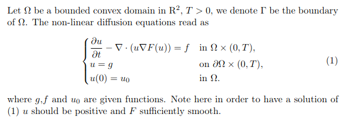
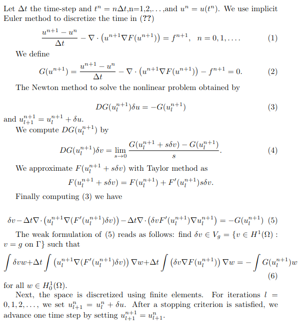
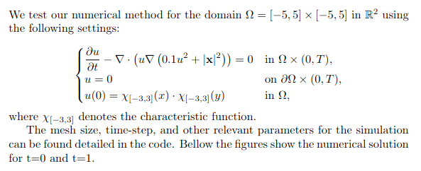
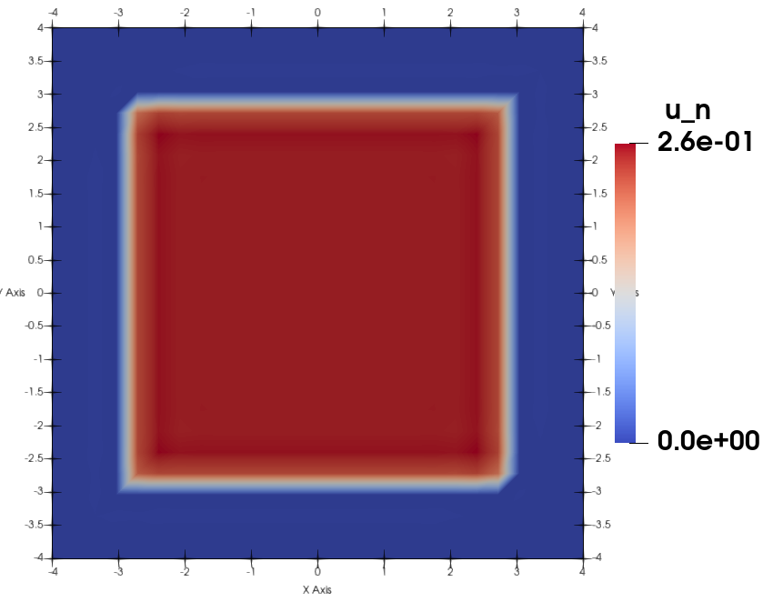
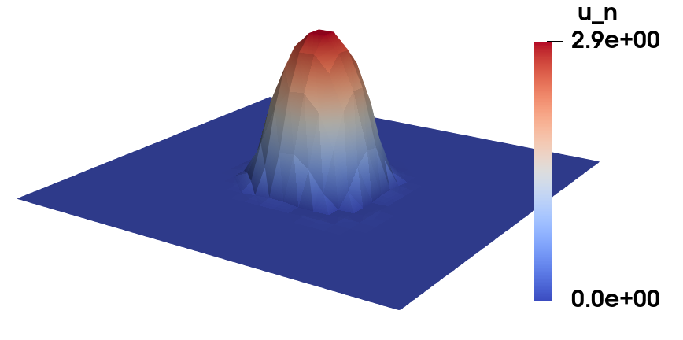

# Non-linear Diffusion Equation Solver

## Introduction

## Numerical Algorithm

## Numerical results

## Tasks

- [ ] Improve documentation.
- [ ] Test convergence order with an exact solution.
- [ ] Fix the convolution term.

